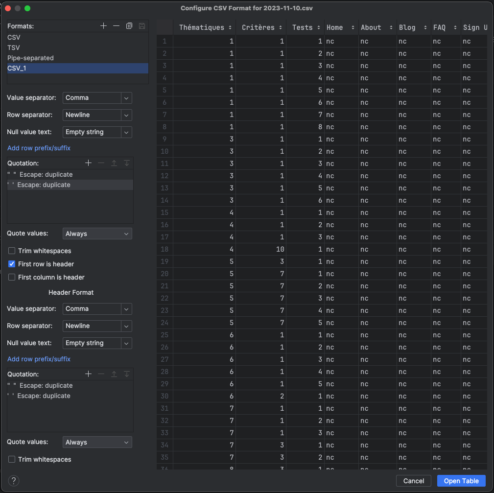

# Mise en place de Frago pour Iroco

- [X] Créer un dépôt GIT
  - License? MIT? CC ?
- [X] Bootstrapper Frago 
  - [X] Theme Frago avec git submodule
  - [X] .gitignore
  - [X] Audit accessibilité de base
- [X] Mettre en place la CI sur CircleCI
- [ ] Déployer avec Ansible
  - [ ] Créer un role clé en main pour installer Frago avec ansible
    - [ ] Créer dépôt `??frago??` dans l’organisation https://github.com/lowdit/
- [ ] Contribuer à Frago
  - Démarrage d’un dépôt Frago
    - [ ] Template GitHub?
      - Pros : facilite le démarrage
      - Cons : on doit le maintenir à jour
        - Ça pourrait se tester automatiquement  
  - Documentation Frago
    - [ ] Hébergement Ansible/Nginx
  - https://lowdit.github.io/frago/docs/demarrer/installer-hugo/#h%C3%A9berger 

## Créer un dépôt Git

Créer dépôt dans github : 

```shell
git init
```

```shell
git remote add origin git@github.com:iroco-co/audits-frago.git
git config pull.rebase true
git branch --set-upstream-to=origin/main main
git pull
git push --set-upstream origin main
```


## Bootstrap Frago

[Installer Hugo](https://lowdit.github.io/frago/docs/demarrer/installer-hugo/).

J’ai choisi d’installer le thème Frago à l’aide des submodules de Git.

```shell
git submodule add -f https://github.com/lowdit/frago.git/ themes/frago && git submodule update --init --recursive && hugo --gc --minify --buildFuture --templateMetrics
```

Tester le site

```shell
hugo serve
```
Ignorer les fichiers générés.

```gitignore
public
.hugo_build.lock
```

Fichier de configuration hugo

```toml
baseURL = 'https://iroco.co/audits'
languageCode = 'en-us'
title = 'Iroco'
theme = "frago"
```

## CI avec CircleCi

```yml
version: 2.1

orbs:
  hugo: circleci/hugo@1.3.0

workflows:
  generate-audits:
    jobs:
      - hugo/build:
          version: 0.120.3
          hugo-extra-flags: --config hugo.toml
          html-proofer: false
          pre-steps:
            - checkout
            - run: git submodule sync
            - run: git submodule update --init
          post-steps:
            - store_artifacts:
                path: public
                destination: audits

```

## Premier audit

`content/audits/iroco-app/index.md`

```md
---
title: Iroco app
---
```

Créé à partir [du modèle RGAA 4.1](https://raw.githubusercontent.com/lowdit/frago/master/exampleSite/exampleFiles//grille-tests-rgaa-4.1.csv)

J'ai supprimé les lignes autres que portant le numéro 25 (audit rapide).
Et positionné des valeurs `"nc"` temporairement pour que ça puisse être interprété par le template Frago.

`content/audits/iroco-app/accessibility/2023-11-10.csv`

```csv
"Thématiques","Critères","Tests","Home","About","Blog","FAQ","Sign Up","Sign In","Newsletter Enrollment","Legal Notices","General Terms of Sale"
"1","1","1","nc","nc","nc","nc","nc","nc","nc","nc","nc"
"1","1","2","nc","nc","nc","nc","nc","nc","nc","nc","nc"
"1","1","3","nc","nc","nc","nc","nc","nc","nc","nc","nc"
"1","1","4","nc","nc","nc","nc","nc","nc","nc","nc","nc"
"1","1","5","nc","nc","nc","nc","nc","nc","nc","nc","nc"
"1","1","6","nc","nc","nc","nc","nc","nc","nc","nc","nc"
"1","1","7","nc","nc","nc","nc","nc","nc","nc","nc","nc"
"1","1","8","nc","nc","nc","nc","nc","nc","nc","nc","nc"
"3","1","1","nc","nc","nc","nc","nc","nc","nc","nc","nc"
"3","1","2","nc","nc","nc","nc","nc","nc","nc","nc","nc"
"3","1","3","nc","nc","nc","nc","nc","nc","nc","nc","nc"
"3","1","4","nc","nc","nc","nc","nc","nc","nc","nc","nc"
"3","1","5","nc","nc","nc","nc","nc","nc","nc","nc","nc"
"3","1","6","nc","nc","nc","nc","nc","nc","nc","nc","nc"
"4","1","1","nc","nc","nc","nc","nc","nc","nc","nc","nc"
"4","1","2","nc","nc","nc","nc","nc","nc","nc","nc","nc"
"4","1","3","nc","nc","nc","nc","nc","nc","nc","nc","nc"
"4","10","1","nc","nc","nc","nc","nc","nc","nc","nc","nc"
"5","3","1","nc","nc","nc","nc","nc","nc","nc","nc","nc"
"5","7","1","nc","nc","nc","nc","nc","nc","nc","nc","nc"
"5","7","2","nc","nc","nc","nc","nc","nc","nc","nc","nc"
"5","7","3","nc","nc","nc","nc","nc","nc","nc","nc","nc"
"5","7","4","nc","nc","nc","nc","nc","nc","nc","nc","nc"
"5","7","5","nc","nc","nc","nc","nc","nc","nc","nc","nc"
"6","1","1","nc","nc","nc","nc","nc","nc","nc","nc","nc"
"6","1","2","nc","nc","nc","nc","nc","nc","nc","nc","nc"
"6","1","3","nc","nc","nc","nc","nc","nc","nc","nc","nc"
"6","1","4","nc","nc","nc","nc","nc","nc","nc","nc","nc"
"6","1","5","nc","nc","nc","nc","nc","nc","nc","nc","nc"
"6","2","1","nc","nc","nc","nc","nc","nc","nc","nc","nc"
"7","1","1","nc","nc","nc","nc","nc","nc","nc","nc","nc"
"7","1","2","nc","nc","nc","nc","nc","nc","nc","nc","nc"
"7","1","3","nc","nc","nc","nc","nc","nc","nc","nc","nc"
"7","3","1","nc","nc","nc","nc","nc","nc","nc","nc","nc"
"7","3","2","nc","nc","nc","nc","nc","nc","nc","nc","nc"
"8","3","1","nc","nc","nc","nc","nc","nc","nc","nc","nc"
"8","4","1","nc","nc","nc","nc","nc","nc","nc","nc","nc"
"8","5","1","nc","nc","nc","nc","nc","nc","nc","nc","nc"
"9","1","1","nc","nc","nc","nc","nc","nc","nc","nc","nc"
"9","1","2","nc","nc","nc","nc","nc","nc","nc","nc","nc"
"9","1","3","nc","nc","nc","nc","nc","nc","nc","nc","nc"
"10","3","1","nc","nc","nc","nc","nc","nc","nc","nc","nc"
"10","6","1","nc","nc","nc","nc","nc","nc","nc","nc","nc"
"10","7","1","nc","nc","nc","nc","nc","nc","nc","nc","nc"
"11","1","1","nc","nc","nc","nc","nc","nc","nc","nc","nc"
"11","1","2","nc","nc","nc","nc","nc","nc","nc","nc","nc"
"11","1","3","nc","nc","nc","nc","nc","nc","nc","nc","nc"
"11","2","1","nc","nc","nc","nc","nc","nc","nc","nc","nc"
"11","2","2","nc","nc","nc","nc","nc","nc","nc","nc","nc"
"11","2","3","nc","nc","nc","nc","nc","nc","nc","nc","nc"
"11","2","4","nc","nc","nc","nc","nc","nc","nc","nc","nc"
"11","2","5","nc","nc","nc","nc","nc","nc","nc","nc","nc"
"11","2","6","nc","nc","nc","nc","nc","nc","nc","nc","nc"
"11","5","1","nc","nc","nc","nc","nc","nc","nc","nc","nc"
"11","6","1","nc","nc","nc","nc","nc","nc","nc","nc","nc"
"11","9","1","nc","nc","nc","nc","nc","nc","nc","nc","nc"
"11","9","2","nc","nc","nc","nc","nc","nc","nc","nc","nc"
"11","10","1","nc","nc","nc","nc","nc","nc","nc","nc","nc"
"11","10","2","nc","nc","nc","nc","nc","nc","nc","nc","nc"
"11","10","3","nc","nc","nc","nc","nc","nc","nc","nc","nc"
"11","10","4","nc","nc","nc","nc","nc","nc","nc","nc","nc"
"11","10","5","nc","nc","nc","nc","nc","nc","nc","nc","nc"
"11","10","6","nc","nc","nc","nc","nc","nc","nc","nc","nc"
"11","10","7","nc","nc","nc","nc","nc","nc","nc","nc","nc"
"12","8","1","nc","nc","nc","nc","nc","nc","nc","nc","nc"
"12","8","2","nc","nc","nc","nc","nc","nc","nc","nc","nc"
"12","9","1","nc","nc","nc","nc","nc","nc","nc","nc","nc"

```

Pour modifier l'audit CSV je recommande d'utiliser le mode "Data" de l'éditeur Jetbrains (IntelliJ, Webstorm ...).


Configuré de la manière suivante : 
- Format
  - Value separator:  Comma
  - Row separator: Newline
  - Null value text : Empty string
  - Quote values: Always
  - Trim whitespaces: `false`
  - First row is header : `true`
  - First column is header: `false`
- Header format
  - Value separator:  Comma
  - Row separator: Newline
  - Null value text : Empty string
  - Quote values: Always
  - Trim whitespaces: `false`



Note (BT): après avoir fait ces réglages et modifié le tableau j'ai observé que IntelliJ supprimait toujours les guillemets. Comme coutournement, il reste la modification en mode texte des valeurs du tableau.